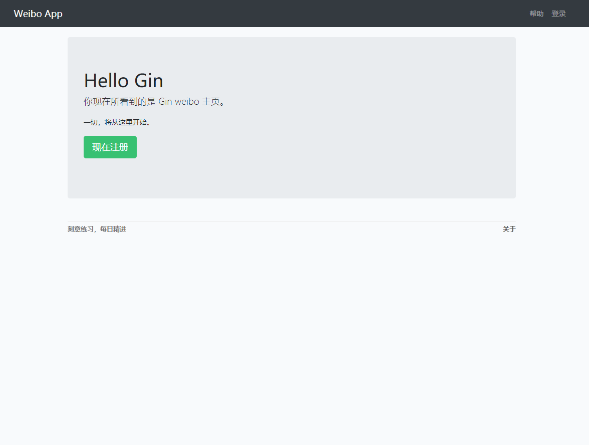
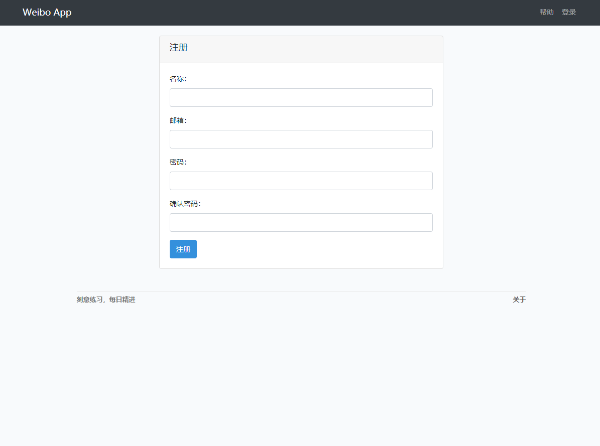
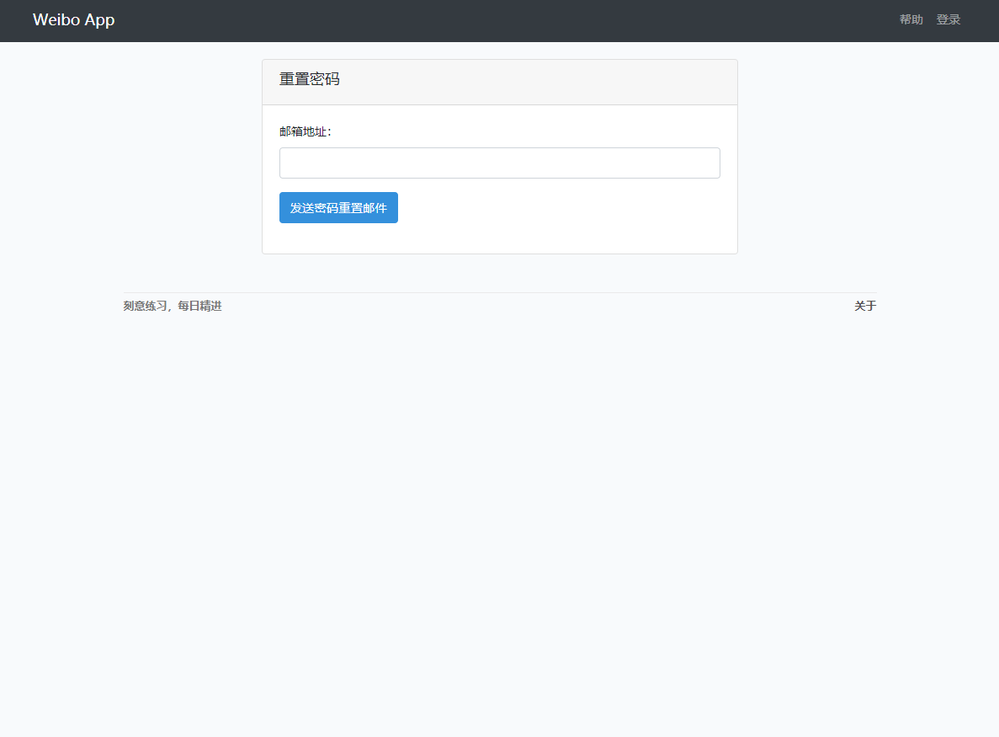
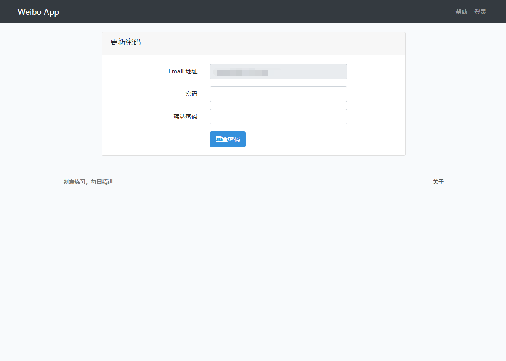
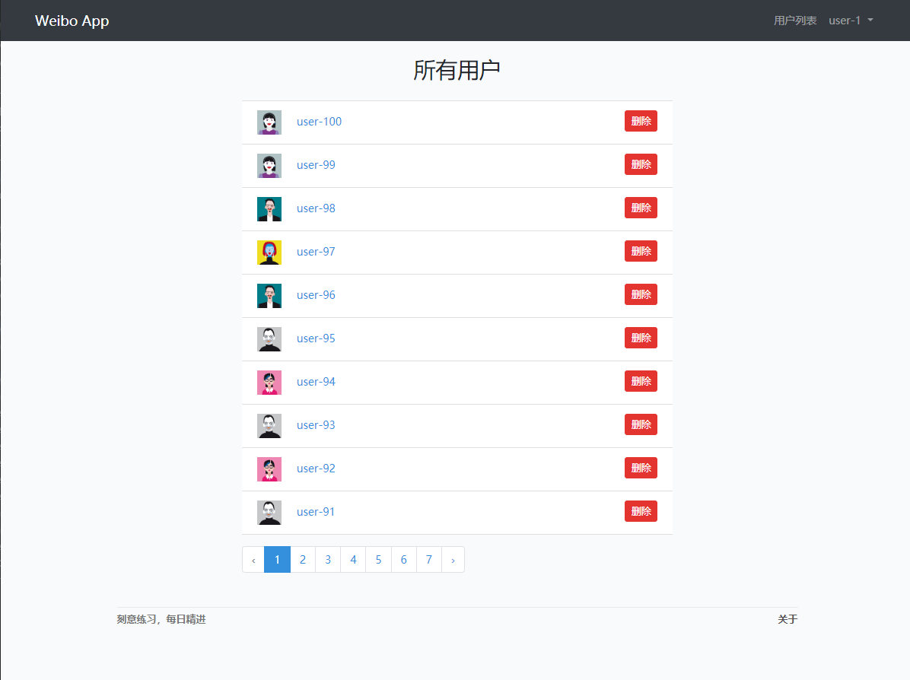
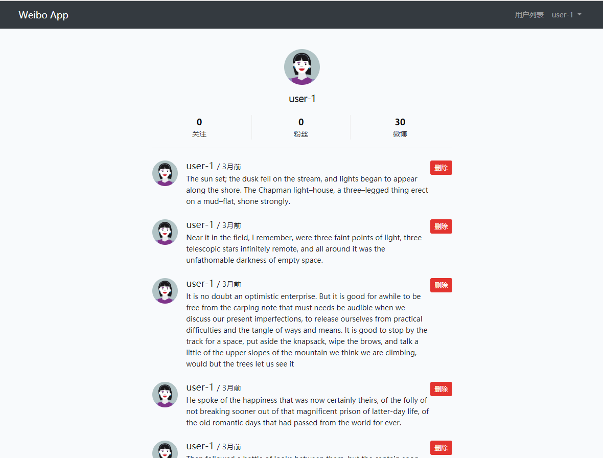
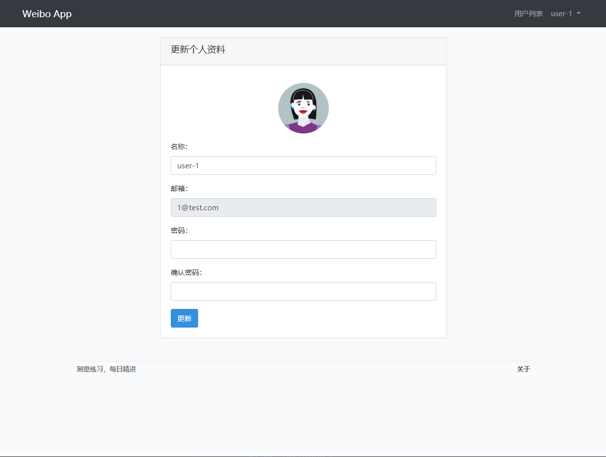
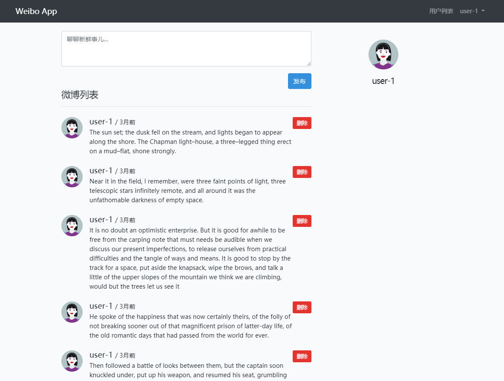

# Gin Weibo App
参考 [L01 Laravel 教程 - Web 开发实战入门](https://learnku.com/courses/laravel-essential-training/5.8)，使用 Golang (Gin、Gorm) 改写。

项目结构和风格模仿 Laravel。

## 相关项目
[L02 Laravel 教程 - Web 开发实战进阶、L03 Laravel 教程 - 实战构架 API 服务器、L04 Laravel 教程 - 微信小程序从零到发布：golang bbs 项目](https://github.com/Away0x/gin_bbs)

[L05 Laravel 教程 - 电商实战、L06 Laravel 教程 - 电商进阶：golang 商城项目](https://github.com/Away0x/echo_shop)

## 启动
```bash
# 需先安装 fresh (https://github.com/gravityblast/fresh)
# 启动前建议配置环境变量: GOPROXY=https://goproxy.io

cd gin_weibo
cp ./config.example.yaml ./config.yaml
make dev # 或者也可直接 fresh -c ./fresh.conf
# 项目相关命令参见 Makefile
```

## 部署
```bash
cd gin_weibo
make
./deploy start
```

## 项目目录结构
<details>
<summary>展开查看</summary>
<pre><code>
├── app              项目核心逻辑代码
│    ├── auth        用户相关
│    ├── controllers 控制器
│    ├── helpers     工具方法
│    ├── models      模型
│    ├── policies    权限校验
│    ├── requests    参数校验
│    ├── services    复杂查询
│    └── view_models 数据转换
│
├── config           配置中心
│
├── database         数据库
│    └── factory     数据 mock
│
├── middleware       中间件
│    └── wrapper     controller 包裹函数
│
├── pkg              项目依赖
│
├── public           项目静态文件
│
├── resources        前端源码
│    └── view        go 模板文件
│
├── routes           路由
│    └── routes.go   路由注册
│    └── api.go      api 路由注册
│    └── web.go      页面路由注册
│    └── named       命名路由模块
│
├── storage          存放日志等文件
│
├── main.go          项目入口
│
├── config.yaml      项目配置
│
├── deploy.sh        部署脚本
│
└── Makefile         Makefile 文件
</code></pre>
</details>

## 实现功能
- [x] CSRF 验证
- [x] flash 消息闪现
- [x] 记忆上次表单提交的数据
- [x] 参数校验模块
- [x] 命名路由
- [x] 分页
- [x] 发送邮件
- [x] 用户权限模块
- [x] 日志
- [x] 前端构建 (typescript、sass ...)


















***
